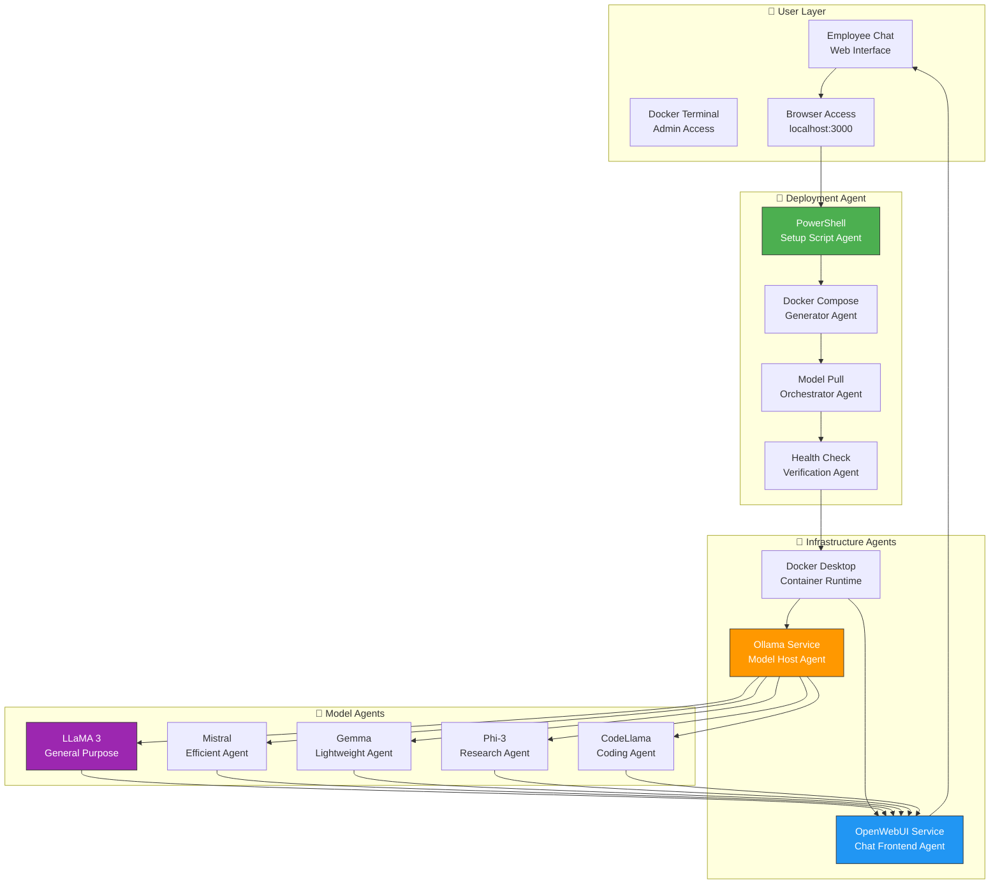
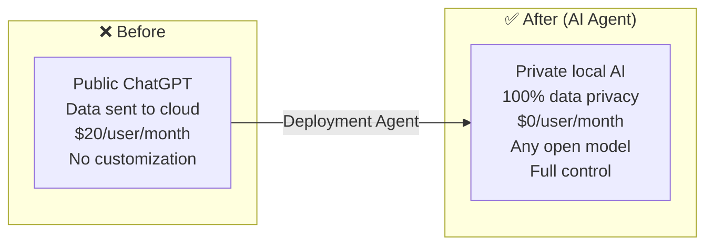

# 🧠 OpenWebUI + Ollama — Enterprise AI Assistant Deployment Agent

> **Transform any Windows PC into a secure, private ChatGPT-like AI assistant**  
> One-click PowerShell deployment agent for local AI. No API keys. No monthly fees.

---

## 🧠 AI Agent Architecture



## 🤖 What Makes This an AI Agent Platform

| Agent | Function |
|-------|----------|
| **PowerShell Deployment Agent** | One-click script: creates project folder, generates docker-compose.yml, pulls LLM models |
| **Docker Compose Generator Agent** | Auto-generates the entire container stack configuration |
| **Model Orchestrator Agent** | Pulls and manages multiple LLM models — switch between them at will |
| **Health Check Agent** | Verifies OpenWebUI + Ollama are running and responsive |
| **Chat Frontend Agent** | OpenWebUI provides ChatGPT-style interface with model switching |

## 🔄 Before vs After



## 🛠 Tech Stack

| Component | Technology | Agent Role |
|-----------|-----------|------------|
| **Chat UI** | OpenWebUI | Front-end agent |
| **LLM Runtime** | Ollama | Model hosting agent |
| **Infrastructure** | Docker + Docker Compose | Container orchestration |
| **Deployment** | PowerShell | Setup automation agent |

## ⚡ Quick Start

```powershell
# Run the deployment agent
.\setup-openwebui-ollama.ps1

# Visit http://localhost:3000
```

## 🎯 Supported AI Models

| Model | Use Case | Size |
|-------|----------|------|
| LLaMA 3 | General purpose chat | 8B |
| Mistral | Efficient, fast responses | 7B |
| Gemma | Lightweight, Google research | 7B |
| Phi-3 | Microsoft research model | 3.8B |
| CodeLlama | Code generation & analysis | 7B |

---

Built by **[Shazaly Musa](https://github.com/SparkSpheartech)** — Founder, SparkSphear Tech  
*AI Agents for Local Enterprise AI Deployment*