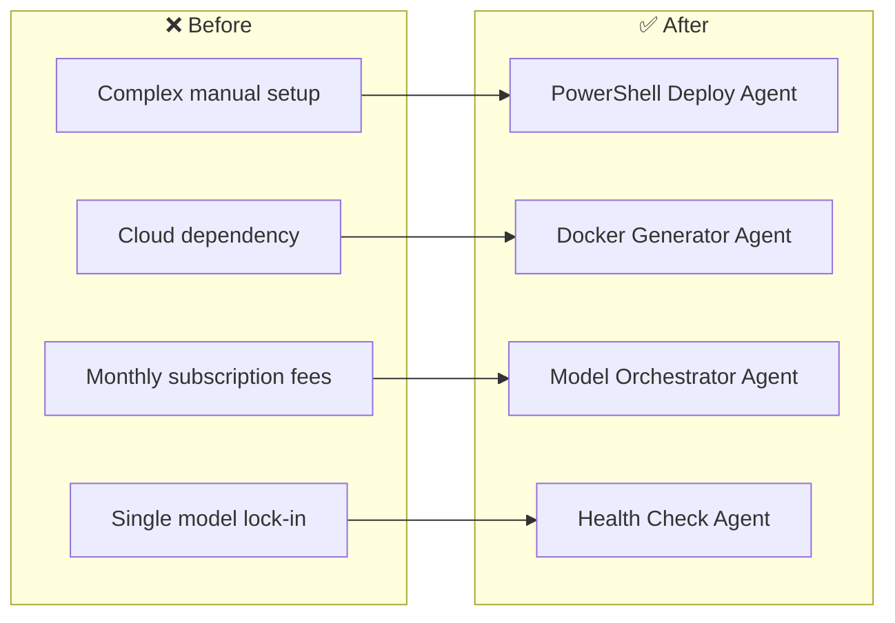
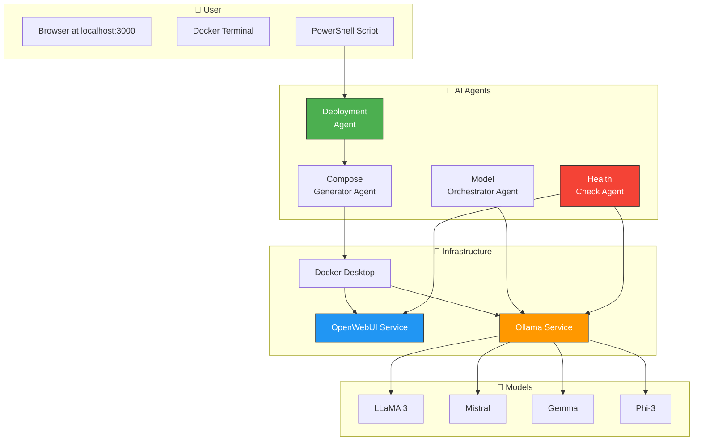

# 🧠 Enterprise AI Infrastructure — AI Agents for Local AI Setup

> SPARKSPHEAR builds AI agents for enterprise AI infrastructure workflows across IT teams and business leaders who need one-click local AI deployment.

**Start With the Workflow. Scale What Works.**

We audit the system, connect the tools that fit, and automate the work that does not require constant manual attention.

---

## ❌ The Problem

Most businesses want AI assistants but face three barriers: data privacy (cannot send internal docs to ChatGPT), cost (enterprise plans are expensive), and complexity (local models need DevOps skills). The IT team does everything — and AI adoption plateaus.

**Before:** Expensive enterprise AI subscriptions, data sent to third-party clouds, complex manual setup, IT bottlenecks, zero AI adoption for most teams.

**After (AI Agent Fleet):** One PowerShell script transforms any Windows PC into a private ChatGPT. OpenWebUI plus Ollama, any open-source model, 100% local, zero monthly fees, data never leaves the building.

---

## 🤖 AI Agent Fleet

Four AI agents that handle the entire AI infrastructure lifecycle — from deployment to health monitoring.

### Architecture

### Answer and route
The agent handles approved AI infrastructure setup by generating Docker Compose configurations, pulling models, and verifying the deployment. It captures the target model, system specs, and network requirements — then executes the deployment path or health check.

### Bring clients back
Use infrastructure-specific return windows (monthly container health checks, quarterly model updates, annual capacity planning) to flag outdated deployments and prepare IT-approved upgrade messages.

### Keep control
Model selection, security policies, and network access rules stay behind permissions, escalation rules, and human review. The agent assists; you remain responsible.

---

## 🚀 Start With One Workflow

We do not start by selling the biggest package. We start by auditing the workflow and identifying the smallest useful agent.

**Workflow Audit — Starting at $297 one-time**
- Current workflow map
- Bottleneck analysis
- Existing-tool review
- Data and access requirements
- Agent suitability assessment
- Three prioritized automation opportunities
- Recommended first agent
- Implementation scope
- Measurement and acceptance plan

**Implementation — One-time build fee**
- Agent development and testing
- Approved integration setup
- Escalation rule configuration
- Acceptance criteria verification

**Monthly Agent Operation — Recurring package fee**

| Package | Price | Best For |
|---------|-------|----------|
| **SIGNAL START** | $297/mo | One narrow workflow, one primary channel, one or two approved integrations |
| **FLOW CONTROL** | $697/mo | Several related workflows with routing, follow-up, and exception handling |
| **SYSTEM LIFT** | $1,497/mo | Multiple workflows, channels, custom rules, and meaningful reporting |
| **SCALE CONTROL** | from $2,997/mo | Multi-location, operations-heavy, custom APIs and dashboards |

This maps to **SIGNAL START** — one narrow workflow (AI infrastructure deployment) with a single primary channel (PowerShell script) and one or two approved integrations (Docker, Ollama).

---

Built by **[Shazaly Musa](https://github.com/SparkSpheartech)** — Founder, SparkSphear Tech  
*Start With the Workflow. Scale What Works.*  
*AI Agents for Enterprise AI Infrastructure*